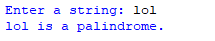
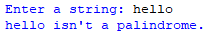

## Description 
This program allows a user to input a string. It then checks whether the provided string is a palindrome, a word or phrase that reads the same forwards and backwards, without considering letter case.
## Example
♡ Example 1  
  
♡ Example 2  

